US 2020 Election Tweet Sentiment Analysis
================
Aleksey Zasorin

Datasets Used:

-   [US Election 2020 Tweets
    Dataset](https://www.kaggle.com/datasets/manchunhui/us-election-2020-tweets)
-   [US Election 2020 Results
    Dataset](https://www.kaggle.com/datasets/unanimad/us-election-2020)

It would be incredibly interesting to perform sentiment analysis on
tweets made around the time of the US 2020 Presidential Election and see
if we can infer anything out of it. We will be using two data sets, one
containing tweets featuring \#JoeBiden or \#Biden, and the other
containing tweets featuring \#DonaldTrump or \#Trump. The data sets may
have some overlap between them.

## Required Libraries

``` r
library("syuzhet")
library("ggplot2")
library("cowplot")
library("forcats")
library("gridExtra")
library("tidyverse")
library("zoo")
library("usmap")
library("parallel")
```

Additionally, the above libraries require the following packages to be
installed:

-   Rcpp
-   maptools
-   rgdal

## Loading and Cleaning Our Dataset

We will load our datasets and clean it up a little bit so that it’s
ready for use.

``` r
data_biden = read.csv("archive/hashtag_joebiden.csv")
data_trump = read.csv("archive/hashtag_donaldtrump.csv")

# This dataset contains some bogus rows, this will filter them out

data_biden = data_biden[!is.na(as.POSIXct(as.character(data_biden$created_at), format = "%Y-%m-%d %H:%M:%S")),]
data_trump = data_trump[!is.na(as.POSIXct(as.character(data_trump$created_at), format = "%Y-%m-%d %H:%M:%S")),]

# This dataset also apparently contains some duplicates, so we will filter them out
# 'tweet_id' should be unique for every tweet

data_biden = data_biden %>% distinct(tweet_id, .keep_all = TRUE)
data_trump = data_trump %>% distinct(tweet_id, .keep_all = TRUE)
```

# Section 1: Exploratory Data Analysis

## How many tweets in our data sets have NA values for columns we care about?

The columns we care about are the location columns.

``` r
normalized_sum = function(x)
{
  missing = sum(x == "")
  present = sum(x != "")
  total = missing + present
  output = missing/total
  output
}

na_biden_sums = sapply(data_biden[,c("lat", "long", "city", "state", "state_code", "country")], normalized_sum)
na_biden = data.frame(columns = factor(names(na_biden_sums)), na_sum = as.numeric(na_biden_sums))
na_biden$candidate = "biden"

na_trump_sums = sapply(data_trump[,c("lat", "long", "city", "state", "state_code", "country")], normalized_sum)
na_trump = data.frame(columns = factor(names(na_trump_sums)), na_sum = as.numeric(na_trump_sums))
na_trump$candidate = "trump"

na_data = rbind(na_biden, na_trump)

g = ggplot(data = na_data, mapping = aes(x = columns, y = na_sum, fill = candidate)) + 
  geom_bar(stat="identity", position="dodge") +
  scale_y_continuous(labels = scales::percent) +
  scale_fill_brewer(palette="Set1", direction=-1) +
  labs(title = "Percentage of Tweets Missing Location Data") +
  ylab(label = "percentage of tweets")

print(g)
```

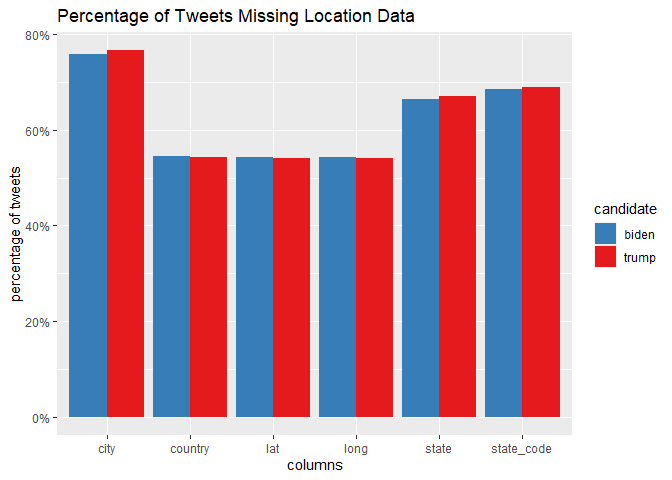<!-- -->

That’s quite a lot of missing values. The upside to this is that our
sentiment analysis won’t take as long.

## How many tweets are in the US and include a state code?

``` r
filter_loc = function(df) subset(df, !(df$state_code %in% c("", "PR", "MP", "GU")) & (df$country == "United States" | df$country == "United States of America"))

us_biden = filter_loc(data_biden)
us_biden$candidate = "biden"

us_trump = filter_loc(data_trump)
us_trump$candidate = "trump"

us_data = rbind(us_biden, us_trump)

g = ggplot(data = us_data, mapping = aes(x = forcats::fct_rev(forcats::fct_infreq(state_code)), fill = candidate)) + 
  geom_bar(mapping = aes(y = (..count..)/sum(..count..)), width = 0.8) +
  scale_y_continuous(labels = scales::percent) +
  scale_fill_brewer(palette="Set1", direction = -1) +
  theme(axis.text.x = element_text(angle = 90, vjust = 0.5, margin = margin(t = 4, b = 10))) +
  labs(title = "Tweets Per State") +
  ylab(label = "percentage of tweets") +
  xlab(label = "states")
  

print(g)
```

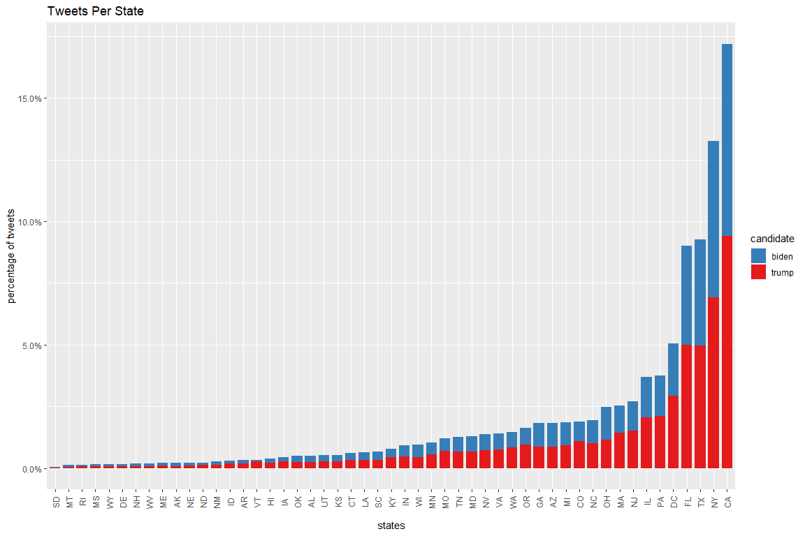<!-- -->

As expected, the amount of tweets per state seems to vary heavily by
population. Some states have very little data and the sentiment values
we derive are unlikely to be accurate. We will use only the tweets that
have the location data we need.

## US Map of Tweet Locations

``` r
us_data$lat = as.numeric(us_data$lat)
us_data$long = as.numeric(us_data$long)

locations = data.frame(lon = as.numeric(us_data$long), lat = as.numeric(us_data$lat))
map_trans = usmap_transform(locations)

g = plot_usmap(labels = TRUE) +
  geom_point(data = map_trans, mapping = aes(x = x, y = y), color = "red", alpha = 0.3)

print(g)
```

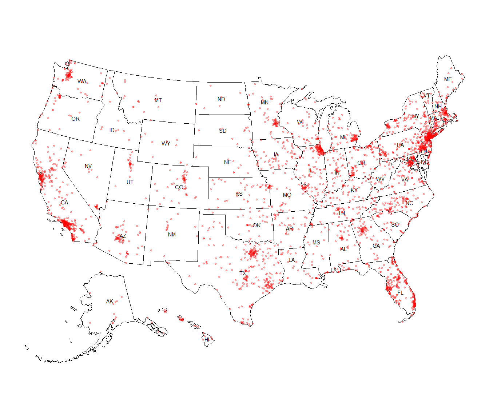<!-- -->

## How many tweets overlap between the Trump and Biden dataset?

``` r
us_biden = subset(us_biden, select = colnames(data_biden))
us_trump = subset(us_trump, select = colnames(data_trump))

total_unique = rbind(us_biden, us_trump)
total_unique = total_unique %>% distinct(tweet_id, .keep_all = TRUE)

biden_only = us_biden[!(us_biden$tweet_id %in% us_trump$tweet_id),]
biden_only$candidate = "biden"

trump_only = us_trump[!(us_trump$tweet_id %in% us_biden$tweet_id),]
trump_only$candidate = "trump"

both_only = semi_join(us_biden, us_trump, by = "tweet_id")
both_only$candidate = "both"

separated_data = rbind(biden_only, trump_only, both_only)

separated_data$candidate <- factor(separated_data$candidate, levels = c("trump", "biden", "both"), ordered = TRUE)

g = ggplot(data = separated_data, mapping = aes(x = candidate, fill = candidate)) + 
  geom_bar(mapping = aes(y = (..count..)/sum(..count..))) +
  scale_fill_brewer(palette="Set1") +
  scale_y_continuous(labels = scales::percent) +
  labs(title = "Overlap Between #Biden and #Trump Data Sets") +
  ylab(label = "percentage of tweets")

print(g)
```

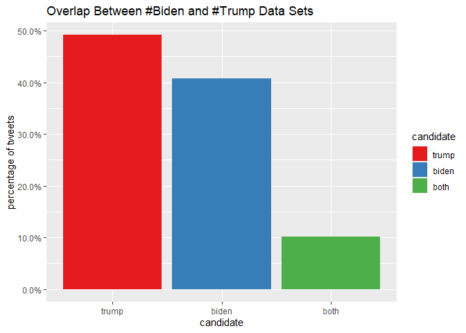<!-- -->

The overlap between the two data sets isn’t major. Most tweets were
exclusively about on candidate or the other

# Section 2: Overview of Sentiment in the US

## Sentiment over time

``` r
# This code segment is here so I can choose to load a smaller subset of the data for faster processing
sample_idx = sample(nrow(separated_data), 1*nrow(separated_data))
sample_data = separated_data[sample_idx,]
```

Here we will calculate our sentiment values for each tweet.

``` r
tweet_sentiment = function(text)
{
  sentences = syuzhet::get_sentences(text)
  sentiments = syuzhet::get_sentiment(sentences, method = "syuzhet")
  mean(sentiments)
}

cl <- makeCluster(detectCores())
sample_data$sentiment = parLapply(cl, sample_data$tweet, tweet_sentiment)
stopCluster(cl)
```

Here we will divide the data set by candidate and calculate a rolling
average. The window size for the rolling average will be determined by
the average tweets per hour in each data set.

``` r
sample_data$sentiment = as.numeric(sample_data$sentiment)

tmp_biden = sample_data[sample_data$candidate == "biden",]
tmp_trump = sample_data[sample_data$candidate == "trump",]
tmp_both = sample_data[sample_data$candidate == "both",]

tmp_biden = tmp_biden[order(tmp_biden$created_at),]
tmp_trump = tmp_trump[order(tmp_trump$created_at),]
tmp_both = tmp_both[order(tmp_both$created_at),]

avg_tph = function(df)
{
  temp_df = df
  temp_df$created_at_hour = as.POSIXct(temp_df$created_at, format = "%Y-%m-%d %H")
  temp_split = split(temp_df, temp_df$created_at_hour)
  
  mean(do.call(rbind, lapply(temp_split, function(x) nrow(x))))
}

biden_tph = avg_tph(tmp_biden)
both_tph = avg_tph(tmp_both)
trump_tph = avg_tph(tmp_trump)

tmp_biden$rollmean = zoo::rollmean(tmp_biden$sentiment, k=8*biden_tph, fill = NA)
tmp_trump$rollmean = zoo::rollmean(tmp_trump$sentiment, k=8*trump_tph, fill = NA)
tmp_both$rollmean = zoo::rollmean(tmp_both$sentiment, k=8*both_tph, fill = NA)

sample_data = rbind(tmp_biden, tmp_trump, tmp_both)
```

Let’s plot the rolling mean for our candidates. It might still be a bit
hard to make out patterns in this, so let’s also plot our data using
`geom_smooth` to get a better idea of the sort of trends going on here.
The darkened gray area is election day, November 3rd.

``` r
date_ranges = data.frame(
  from = base::as.Date(c("2020-11-03")),
  to = base::as.Date(c("2020-11-04"))
)

hour_ranges = data.frame(
  from = as.POSIXct(c("2020-11-03 00:00:00")),
  to = as.POSIXct(c("2020-11-04 00:00:00"))
)

g = ggplot() +
  geom_line(data = sample_data, mapping = aes(x = as.POSIXct(created_at, format = "%Y-%m-%d %H:%M:%S"), y = rollmean, color = candidate), size = 0.6) +
  geom_rect(data = hour_ranges, aes(xmin = from, xmax = to, ymin = -Inf, ymax = Inf), alpha = 0.4) +
  scale_color_brewer(palette = "Set1") +
  labs(title = "Sentiment of Tweets Near Election Day") +
  ylab(label = "sentiment (rolling mean)") +
  xlab(label = "date")

print(g)
```

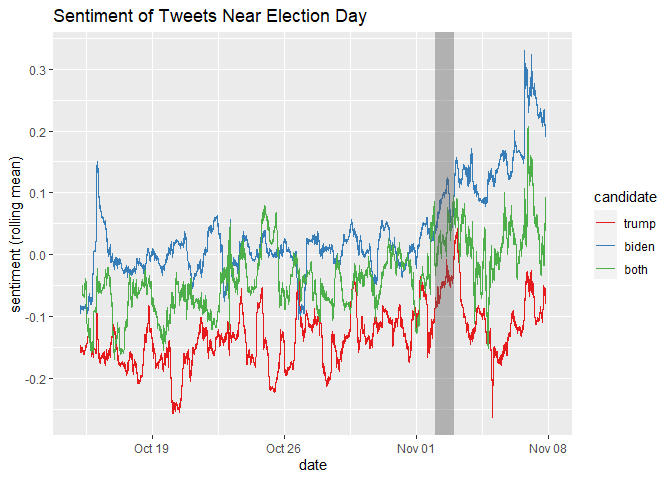<!-- -->

``` r
gs = ggplot() +
  geom_smooth(data = sample_data, mapping = aes(x = as.POSIXct(created_at, format = "%Y-%m-%d %H:%M:%S"), y = sentiment, color = candidate)) +
  geom_rect(data = hour_ranges, aes(xmin = from, xmax = to, ymin = -Inf, ymax = Inf), alpha = 0.4) +
  scale_color_brewer(palette = "Set1") +
  labs(title = "Sentiment of Tweets Near Election Day") +
  ylab(label = "sentiment (smoothed)") +
  xlab(label = "date")

print(gs)
```

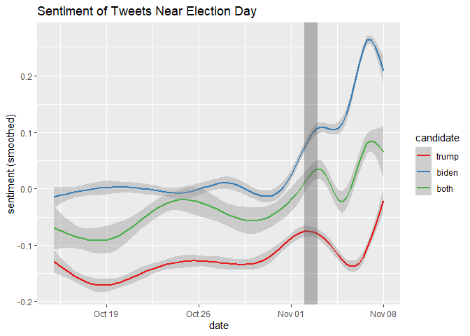<!-- -->

It seems on average, the sentiment towards Donald Trump is lower
compared to Joe Biden. This could be a bias caused by the political
leanings of people that use Twitter. We can see Joe Biden’s sentiment
increase after election day, and Donald Trump’s decrease. This makes
sense given the result of the election.

Let’s take a closer look at election day.

``` r
tmp_biden$rollmean = zoo::rollmean(tmp_biden$sentiment, k=6*biden_tph, fill = NA)
tmp_trump$rollmean = zoo::rollmean(tmp_trump$sentiment, k=6*trump_tph, fill = NA)
tmp_both$rollmean = zoo::rollmean(tmp_both$sentiment, k=6*both_tph, fill = NA)

sample_data_range = rbind(tmp_biden, tmp_trump, tmp_both)
sample_data_range = sample_data_range[sample_data_range$created_at >= "2020-11-01 00:00:00" & sample_data_range$created_at < "2020-11-06 00:00:00",]

g = ggplot() +
  geom_line(data = sample_data_range, mapping = aes(x = as.POSIXct(created_at, format = "%Y-%m-%d %H:%M:%S"), y = rollmean, color = candidate), size = 0.6) +
  geom_rect(data = hour_ranges, aes(xmin = from, xmax = to, ymin = -Inf, ymax = Inf), alpha = 0.4) +
  scale_color_brewer(palette = "Set1") +
  labs(title = "Sentiment of Tweets Near Election Day") +
  ylab(label = "sentiment (rolling mean)") +
  xlab(label = "date")

print(g)
```

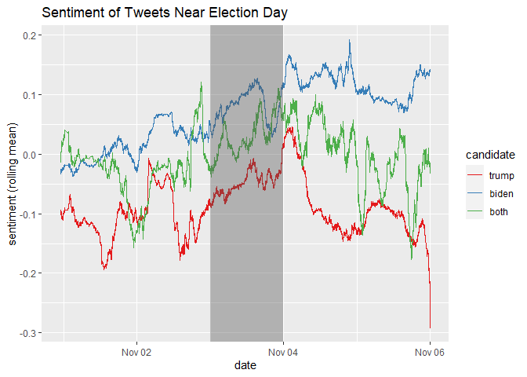<!-- -->

``` r
gs = ggplot() +
  geom_smooth(data = sample_data_range, mapping = aes(x = as.POSIXct(created_at, format = "%Y-%m-%d %H:%M:%S"), y = sentiment, color = candidate)) +
  geom_rect(data = hour_ranges, aes(xmin = from, xmax = to, ymin = -Inf, ymax = Inf), alpha = 0.4) +
  scale_color_brewer(palette = "Set1") +
  labs(title = "Sentiment of Tweets Near Election Day") +
  ylab(label = "sentiment (smoothed)") +
  xlab(label = "date")

print(gs)
```

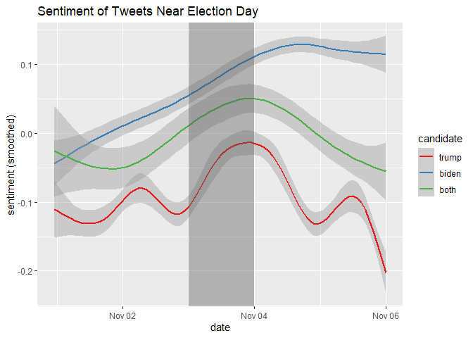<!-- -->

It’s interesting to see that there seems to be a drop in sentiment score
for Joe Biden towards the end of election day. Perhaps this is people
losing confidence in Joe Biden due to several states appearing red
before all votes were counted.

# Section 3: Predict State Outcomes

## Can we predict the outcome of battleground states?

Let’s try to predict the outcome of the battleground states using the
sentiment average, median, and standard deviation values! We will load
our election results data to train a linear model.

``` r
president_state = read.csv("election/president_state.csv")
president_county_candidate = read.csv("election/president_county_candidate.csv")

president_county_candidate = president_county_candidate %>% rename(total_candidate_votes = total_votes)

biden_votes = president_county_candidate[president_county_candidate$candidate == "Joe Biden",]
trump_votes = president_county_candidate[president_county_candidate$candidate == "Donald Trump",]

tmp_biden_split = split(biden_votes, biden_votes$state)
tmp_trump_split = split(trump_votes, trump_votes$state)

sum_by_states = function(df)
{
  state = df[1,"state"]
  output_df = data.frame(state = state, total_candidate_votes = sum(df$total_candidate_votes))
  output_df
}

list_biden = lapply(tmp_biden_split, sum_by_states)
list_trump = lapply(tmp_trump_split, sum_by_states)

biden_votes = do.call(rbind, list_biden)
trump_votes = do.call(rbind, list_trump)

biden_votes = biden_votes %>% inner_join(president_state, by = "state")
trump_votes = trump_votes %>% inner_join(president_state, by = "state")

biden_votes$vote_percent = biden_votes$total_candidate_votes/biden_votes$total_votes * 100
trump_votes$vote_percent = trump_votes$total_candidate_votes/trump_votes$total_votes * 100

all_votes = biden_votes %>% inner_join(trump_votes, by = "state", suffix = c(".biden", ".trump"))
```

``` r
tmp_biden_range = tmp_biden[tmp_biden$created_at < "2020-11-03 00:00:00",]
tmp_both_range = tmp_both[tmp_both$created_at < "2020-11-03 00:00:00",]
tmp_trump_range = tmp_trump[tmp_both$created_at < "2020-11-03 00:00:00",]

list_tmp_biden = split(tmp_biden_range, tmp_biden_range$state)
list_tmp_both = split(tmp_both_range, tmp_both_range$state)
list_tmp_trump = split(tmp_trump_range, tmp_trump_range$state)

mean_by_state = function(df)
{
  state = df[1, "state"]
  candidate = df[1,"candidate"]
  mean_sentiment = mean(df$sentiment)
  median_sentiment = median(df$sentiment)
  sd_sentiment = sd(df$sentiment)
  
  output_df = data.frame(state = state)
  
  if(candidate == "biden")
  {
    output_df$biden_mean_sentiment = mean_sentiment
    output_df$biden_median_sentiment = median_sentiment  
    output_df$biden_sd_sentiment = sd_sentiment  
  }
  else if(candidate == "trump")
  {
    output_df$trump_mean_sentiment = mean_sentiment
    output_df$trump_median_sentiment = median_sentiment
    output_df$trump_sd_sentiment = sd_sentiment
  }
  else
  {
    output_df$both_mean_sentiment = mean_sentiment
    output_df$both_median_sentiment = median_sentiment
    output_df$both_sd_sentiment = sd_sentiment
  }
  
  output_df
}

biden_applied = lapply(list_tmp_biden, mean_by_state)
both_applied = lapply(list_tmp_both, mean_by_state)
trump_applied = lapply(list_tmp_trump, mean_by_state)

biden_df = do.call(rbind, biden_applied)
both_df = do.call(rbind, both_applied)
trump_df = do.call(rbind, trump_applied)

sentiment_df = biden_df %>% inner_join(trump_df, by = "state") %>% inner_join(both_df, by = "state") %>% inner_join(all_votes, by = "state")
sentiment_df$biden_won = ifelse(sentiment_df$vote_percent.biden > sentiment_df$vote_percent.trump, "TRUE", "FALSE")
sentiment_df$trump_won = ifelse(sentiment_df$vote_percent.biden <= sentiment_df$vote_percent.trump, "TRUE", "FALSE")
```

Here we will reserve the battleground states as our testing data, and
use the rest as our training data.

``` r
state_indices = c("Arizona", "Florida", "Georgia", "Maine", "Michigan", "Minnesota", "Nebraska", "Nevada", "New Hampshire", "North Carolina", "Pennsylvania", "Wisconsin")
training_set = sentiment_df[!(sentiment_df$state %in% state_indices),]

test_set = sentiment_df[sentiment_df$state %in% state_indices,]
```

We will train our model using the statistics we have generated from the
sentiment scores as inputs and attempt to predict the vote percentage
each candidate got. We will compare the real vote percentages each
candidate got in each battleground state and compare it to our predicted
values by calculating the mean-squared error.

``` r
mse = function(model, testdata, col)
{
  yhat = predict(model, testdata)
  y = testdata[, col]
  
  if(is.matrix(yhat) | is.array(yhat))
  {
    yhat = yhat[,col]
    d2 = (yhat - y)^2
    mean(d2)
  }
  else
  {
    d2 = (yhat - y)^2
    mean(d2)
  }
}

fit_linear = lm(cbind(vote_percent.biden, vote_percent.trump) ~ biden_mean_sentiment + trump_mean_sentiment + both_mean_sentiment, data = training_set)

test_set$type = "actual"

mse(fit_linear, test_set, "vote_percent.biden")
```

    ## [1] 5.648367

``` r
mse(fit_linear, test_set, "vote_percent.trump")
```

    ## [1] 6.222093

Those MSE values are pretty decent! In this case, we used the mean
sentiment for the Biden, Trump, and both candidate tweets as our input
variables. Looks like on average, we’re off by about 2.4%. It seems
small, but this could make a huge difference in an election. As a note,
these results are highly dependent on which states are in our training
data and which ones are in our testing data. This is due to the amount
of data available for each state.

Let’s try playing around with the input variables and see if we can get
a lower MSE.

``` r
fit_linear = lm(cbind(vote_percent.biden, vote_percent.trump) ~ biden_mean_sentiment + trump_mean_sentiment + biden_sd_sentiment, data = training_set)
mse(fit_linear, test_set, "vote_percent.biden")
```

    ## [1] 3.807561

``` r
mse(fit_linear, test_set, "vote_percent.trump")
```

    ## [1] 3.696752

These are the lowest MSE values we were able to get. Adding anymore
variables seems to overfit the model and give increasingly inaccurate
results. On average, it seems we are around 1.95% off.

To demonstrate this, let’s use the sentiment mean and standard deviation
of the Biden, Trump, and both candidate tweets.

``` r
fit_linear = lm(cbind(vote_percent.biden, vote_percent.trump) ~ biden_mean_sentiment + trump_mean_sentiment + both_mean_sentiment + biden_sd_sentiment + trump_sd_sentiment + both_sd_sentiment, data = training_set)
mse(fit_linear, test_set, "vote_percent.biden")
```

    ## [1] 27.59978

``` r
mse(fit_linear, test_set, "vote_percent.trump")
```

    ## [1] 22.58975

Worse.

Let’s try using all of the statistics we calculated by including the
median sentiment.

``` r
fit_linear = lm(cbind(vote_percent.biden, vote_percent.trump) ~ biden_mean_sentiment + trump_mean_sentiment + both_mean_sentiment + biden_sd_sentiment + trump_sd_sentiment + both_sd_sentiment + biden_median_sentiment + trump_median_sentiment + both_median_sentiment, data = training_set)
mse(fit_linear, test_set, "vote_percent.biden")
```

    ## [1] 33.22922

``` r
mse(fit_linear, test_set, "vote_percent.trump")
```

    ## [1] 25.67053

Even worse.

Let’s get a better look at what the predicted vote percentages look like
by graphing the actual and predicted values together.

``` r
plot_linear_model = function(model, dataset)
{
  yhat_tmp = predict(model, dataset)
  colnames(yhat_tmp) = c("vote_percent.biden", "vote_percent.trump")
  
  tmp_test_df = dataset
  tmp_df = dataset
  tmp_df$type = "predicted"
  tmp_df$vote_percent.biden = yhat_tmp[,"vote_percent.biden"]
  tmp_df$vote_percent.trump = yhat_tmp[,"vote_percent.trump"]
  
  tmp_df = rbind(tmp_test_df, tmp_df)
  
  g = ggplot(data = tmp_df, mapping = aes(x = state, y = vote_percent.biden, fill = type)) +
    geom_col(position="dodge") +
    coord_cartesian(ylim=c(30,70)) +
    labs(title = "Actual and Predicted Vote Percentages for Joe Biden") +
    ylab(label = "vote percentage")
  print(g)

  g = ggplot(data = tmp_df, mapping = aes(x = state, y = vote_percent.trump, fill = type)) +
    geom_col(position="dodge") +
    coord_cartesian(ylim=c(30,70)) +
    labs(title = "Actual and Predicted Vote Percentages for Donald Trump") +
    ylab(label = "vote percentage")
  print(g)
}
```

``` r
fit_linear = lm(cbind(vote_percent.biden, vote_percent.trump) ~ biden_mean_sentiment + trump_mean_sentiment + biden_sd_sentiment, data = training_set)
plot_linear_model(fit_linear, test_set)
```

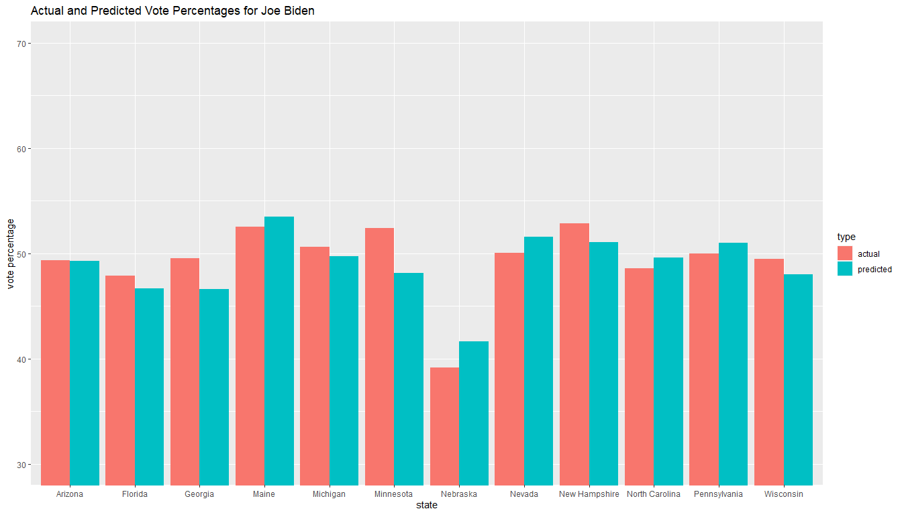<!-- -->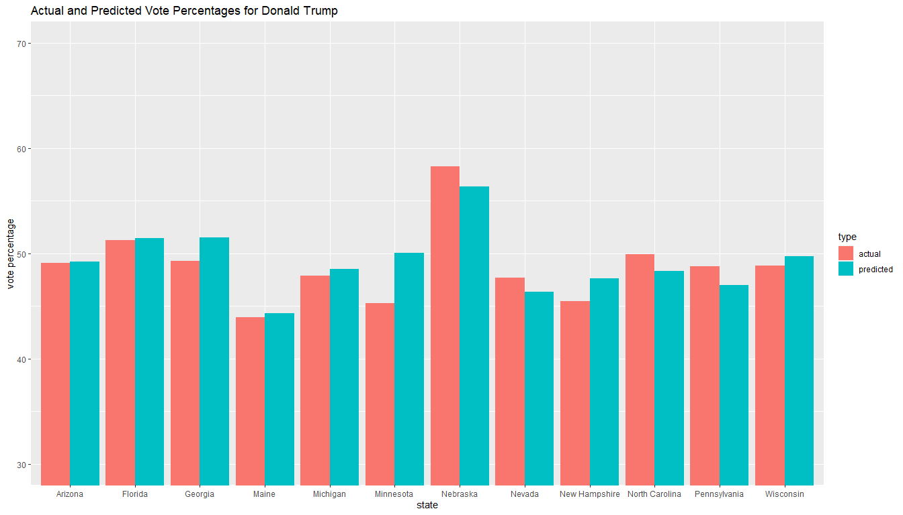<!-- -->
As you can see, the predictions are pretty close in some cases!

Let’s take a look at how many states we were able to predict correctly.

``` r
map_linear_model = function(model, dataset)
{
  yhat_tmp = predict(model, dataset)
  colnames(yhat_tmp) = c("vote_percent.biden", "vote_percent.trump")
  
  tmp_df = dataset
  tmp_df$type = "predicted"
  tmp_df$vote_percent.biden = yhat_tmp[,"vote_percent.biden"]
  tmp_df$vote_percent.trump = yhat_tmp[,"vote_percent.trump"]
  tmp_df$predicted_biden_won = ifelse(tmp_df$vote_percent.biden > tmp_df$vote_percent.trump, "TRUE", "FALSE")
  tmp_df$predicted_trump_won = ifelse(tmp_df$vote_percent.biden <= tmp_df$vote_percent.trump, "TRUE", "FALSE")
  tmp_df$result = ifelse(tmp_df$biden_won == tmp_df$predicted_biden_won & tmp_df$trump_won == tmp_df$predicted_trump_won, "correct", "incorrect")
  
  colors = c("correct" = "#F8766D", "incorrect" = "#00BFC4", "NA" = "grey60")
  
  g = ggplot(data = tmp_df, mapping = aes(x = type, fill = result)) +
    geom_bar(mapping = aes(y = (..count..)/sum(..count..)), width = 0.8) +
    theme(axis.text = element_blank(), axis.ticks = element_blank(), panel.grid.major = element_blank(), panel.grid.minor = element_blank(), panel.background = element_blank()) +
    xlab(label = element_blank()) +
    ylab(label = element_blank()) +
    geom_text(mapping = aes(y = (..count..)/sum(..count..), label = scales::percent((..count..)/sum(..count..))), stat = "count", position = position_stack(0.5)) +
    scale_fill_manual(values = colors, limits = c("correct", "incorrect", "NA"), labels = c("correct", "incorrect", "NA"))
  
  map = plot_usmap(data = tmp_df, values = "result", labels = TRUE) +
    theme(legend.position = "none") +
    guides(fill=guide_legend(title="predicted correctly"))

  return(gridExtra::grid.arrange(
    map, g, ncol = 2, nrow = 3, widths = c(5, 1), heights = c(1, 5, 1),
    layout_matrix = rbind(c(1, NA),
                          c(1, 2),
                          c(1, NA)),
    top = grid::textGrob(
      "States Predicted Correctly",
      gp = grid::gpar(fontsize = 14),
      vjust = 0.6
    )
  ))
}
```

``` r
fit_linear = lm(cbind(vote_percent.biden, vote_percent.trump) ~ biden_mean_sentiment + trump_mean_sentiment + biden_sd_sentiment, data = training_set)
map_linear_model(fit_linear, test_set)
```

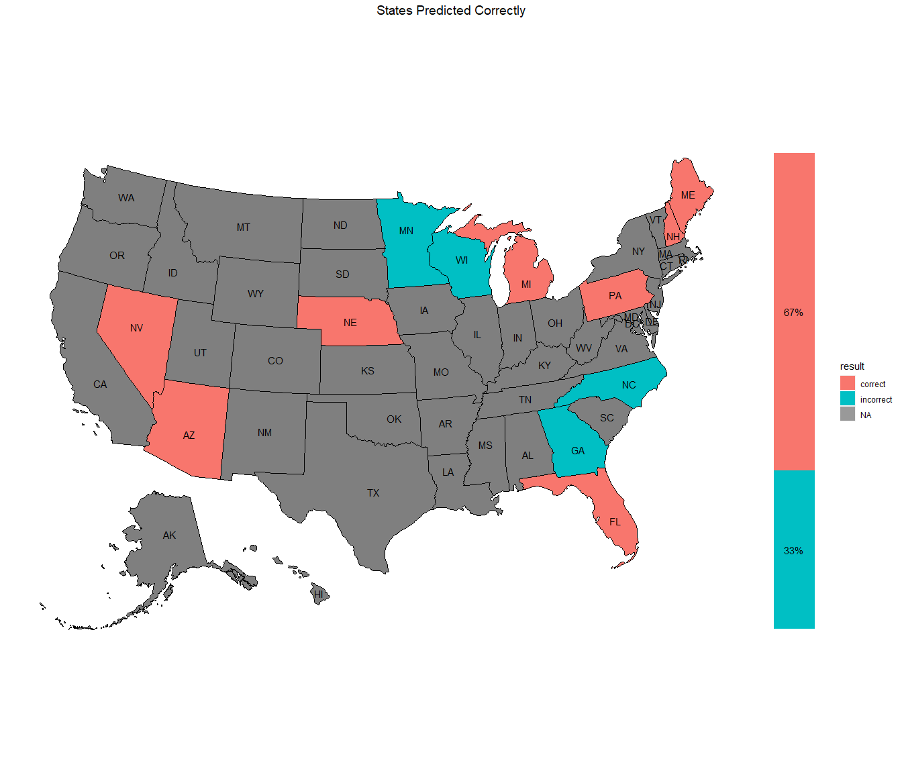<!-- -->

Not bad, a bit better than just guessing!

One thing to note, is that the amount of states guessed correctly
actually goes up if we add more input variables. In this case, we will
add the standard deviation values. Even though the MSE for this model is
worse than the previous one, it predicted the outcomes more accurately.

``` r
fit_linear = lm(cbind(vote_percent.biden, vote_percent.trump) ~ biden_mean_sentiment + trump_mean_sentiment + both_mean_sentiment + biden_sd_sentiment + trump_sd_sentiment + both_sd_sentiment, data = training_set)
map_linear_model(fit_linear, test_set)
```

<!-- -->

I suspect this could be due to the fact that as we add more input
variables, the predictions become more “exaggerated” in the *correct*
direction. So even though the predicted value is further from the actual
value, it is further in the correct direction. This is just a guess,
though.

# Section 4: Future Ideas

I hope to expand on this more in the future by analyzing the actual
emotional sentiment (anger, sadness, happiness) present in these tweets
and generate some visualizations from that. It would be interesting to
see if the specific emotional sentiment could improve our linear model
accuracy. Additionally, I would like to try different machine learning
methods to predict state outcomes.
